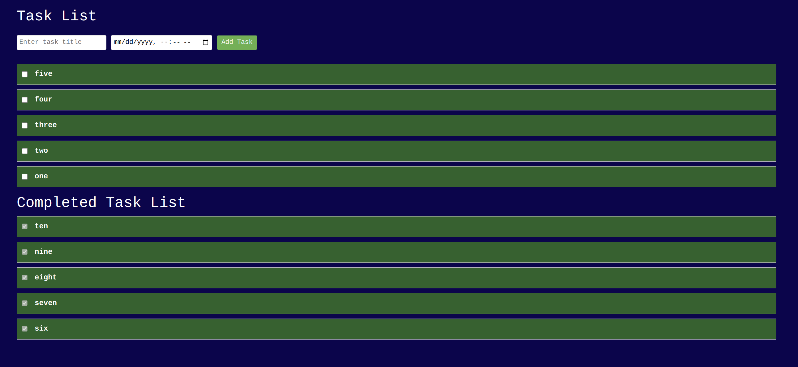

 

## Symfony api platform
This is a test for api platfrom for todo lists fuctionalities

## Steps of Installation

- ```git clone https://github.com/amsalu-tadesse/todolist-exam.git```
- ```cd symfony-api```
- update .env according to your database credentials
- composer install
- run ```bin/console doctrine:database:create``` to create database
- open terminal and run ```symfony server:start -d```
- ```cd todo-list-client``` to go to frontend application
- ```yarn install```
- ```yarn serve```
- open the link generated from yarn command

## Video for how to run the application
- video https://www.loom.com/share/479e060ef6b94365b9bd33224fa706c0
